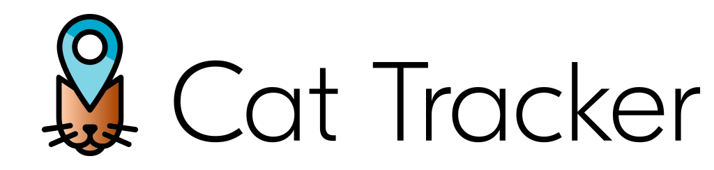

# _Bifravst_

> Gvðín gerþu bru af iorþu til himins, er heitir Bifravst.

  

🚧 Development progress is managed in
[this GitHub Project](https://github.com/orgs/bifravst/projects/1).

❓ You can get in touch by
[creating an issue in this repository](https://github.com/bifravst/bifravst/issues/new),  
or via [DevZone](https://devzone.nordicsemi.com/) (please use the tag
[bifravst](https://devzone.nordicsemi.com/search?q=bifravst) to mark your
questions).  
💬 There is also [a chat on Spectrum](https://spectrum.chat/bifravst).

## Vision

_Bifravst_ aims to provide a concrete end-to-end example for an IoT product in
the asset tracker space, a _Cat Tracker_.

**With _Bifravst_ developers are enabled to set up a real world IoT solution
using their cloud provider and start adapting the example firmware and software
for their use case within minutes.**

_Bifravst_ aims to provide answers and best practices to these questions:

- _How can I connect Nordic's cellular IoT chips to my cloud provider?_
- _How do devices send data into the cloud?_
- _How can data be sent to the devices?_
- _How can users and other services interact with devices?_
- _How can I update the application firmware of my devices while they are
  deployed in the field?_
- _How can I develop an IIoT product that maximizes battery life, minimizes data
  usage and handles unreliable connectivity gracefully_?

_Bifravst_ is licensed under the [3-clause BSD license](./LICENSE) (software)
and the
[Nordic 5-clause BSD license](https://github.com/bifravst/firmware/blob/saga/LICENSE)
(firmware).

### Project characteristics overview

| Characteristic                     | Principle                |
| ---------------------------------- | ------------------------ |
| **Development model**              | Open                     |
| **License**                        | Open Source              |
| **Cloud vendor support**           | Multiple                 |
| **Feature set**                    | Specialized, small       |
| **Hosting**                        | self-hosted              |
| **User Interface**                 | Mobile-first web-app     |
| **Cloud Tenancy**                  | single                   |
| **Integration of Cloud resources** | native                   |
| **Device paradigm**                | offline most of the time |
| **Sensor timestamping**            | device side              |

### Core principles

_Bifravst_ is built around the following principles:

- _teach through showing_: all examples are designed to solve a concrete
  use-case (a _Cat Tracker_) instead of providing generic or abstract solutions.
  _Bifravst_ is not a framework, but a real application.
- _err on the side of security_: _Bifravst_ follows the most robust security
  recommendations of the respective cloud provider.
- _single tenancy_: _Bifravst_ implements a scenario in which all authenticated
  users can be trusted to access all devices. This is a typical scenario in IIoT
  products and simplifies the onboarding of new devices.
- _serverless_: _Bifravst_ uses a serverless architecture as much as possible to
  have near zero costs for the operation during development but provide
  horizontal scaling resources to be used in a production system if needed.
- _cloud native_: _Bifravst_ examples are designed following the respective
  cloud providers' best practices to reduce development efforts due to
  abstraction.
- _being offline is not an exception_: highly mobile IIoT products need to
  handle unreliable connections gracefully, by implementing mechanisms to retry
  sending of failed data. This also means that the sensor measurements need to
  be timestamped when they are created, not when they arrive at the cloud.
- _maximize powersaving_: the firmware examples should highlight power-saving
  features of the nRF9160 because this is critical for developing very small
  form-factor devices.

### System overview and technical considerations

Devices connect to the message broker using TLS over TCP. The messaging protocol
is JSON over MQTT. The TLS certificates are generated offline by the developer
to simplify provision during production.

The cloud and web application will be developed using
[TypeScript](https://www.typescriptlang.org/) (a typed superset of JavaScript).
JavaScript is the most popular language according to a
[2019 Stack Overflow survey](https://insights.stackoverflow.com/survey/2019#technology).
All (or at least most) cloud providers provide SDKs in JavaScript.

It provides tools to configure the developers’ cloud account for use with their
devices and the SPA. After the cloud account has been configured it provides the
necessary resources for asset trackers to connect to the message broker and send
and receive messages and the appropriate APIs for the SPA to interact with these
devices.

The mobile-first single-page application (SPA) will be developed using
[create-react-app](https://github.com/facebook/create-react-app) and provides a
reference implementation of a user-interface to control and interact with the
devices.

The web application offers these features:

- User registration including password recovery
  - Optional: User approval by an admin.
- Listing of asset trackers
- Viewing of asset trackers
  - Current and historical device data
    - GPS location
    - Battery voltage
    - Accelerometer
  - Configure asset tracker
    - Update interval
    - Sensor threshold
- Managing of asset trackers
  - Delete tracker
  - Firmware update

### Supported Cloud Providers

|                  | Amazon Web Services                                                                     | Google Cloud                                                  | Microsoft Azure                                               | Alibaba Cloud |
| ---------------- | --------------------------------------------------------------------------------------- | ------------------------------------------------------------- | ------------------------------------------------------------- | ------------- |
| LTE-M: TCP+MQTT  | [feature complete](https://bifravst.gitbook.io/bifravst/bifravst-on-aws/gettingstarted) | [in progress](https://github.com/bifravst/bifravst/issues/25) | [in progress](https://github.com/bifravst/bifravst/issues/29) | intended      |
| NB-Iot: UDP+CoAP | intended                                                                                | intended                                                      | intended                                                      | intended      |

For cloud providers that have no native UDP+CoAP support using a bridge, e.g.
[Eclipse Californium](https://github.com/eclipse/californium), shall be
evaluated.

---

**Acknowledgments**  
_Pin Icon created by Nun from the Noun Project._  
_Cat Icon created by Focus Lab from the Noun Project._  
_Amazon Web Services, the aws logo are trademarks of Amazon.com, Inc. or its
affiliates in the United States and/or other countries._  
_Google and the Google logo are registered trademarks of Google LLC._  
_Microsoft and Azure are registered trademarks of Microsoft Corporation in the
United States and/or other countries._
