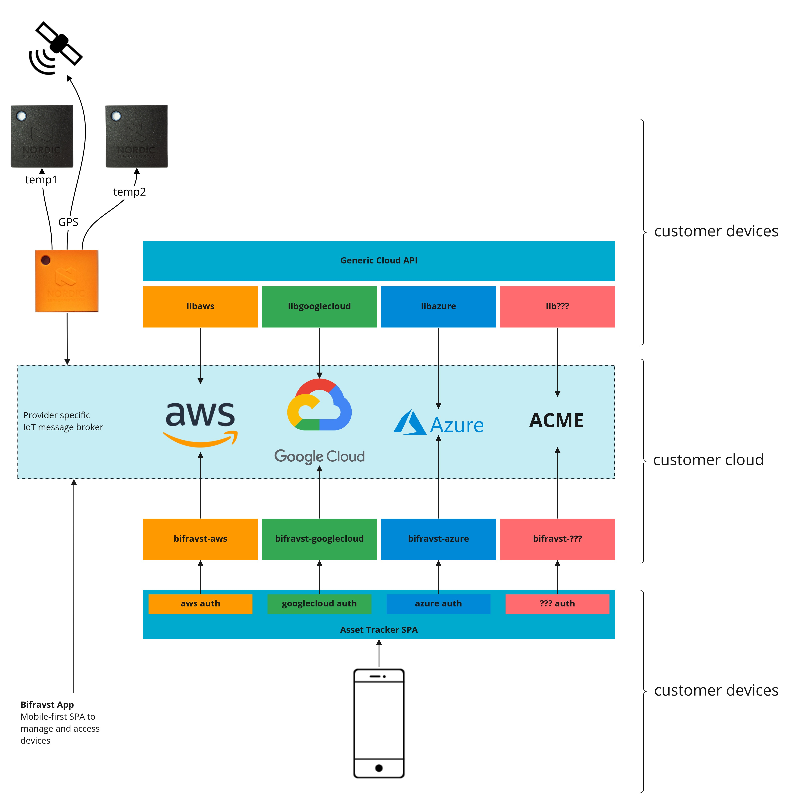

.. _bifra_readme:

Bifravst
########

.. epigraph::

   *Gvðín gerþu bru af iorþu til himins, er heitir Bifravst.*
   Bifravst is a term from the Nordic mythology and it refers to the bridge built by the gods between earth and heaven.
   `Read more about it <https://www.lyngen.com/2020/03/the-vikings-and-the-northern-lights-bridge/>`_.

.. image:: https://github.com/bifravst/bifravst/workflows/Test%20and%20Release/badge.svg
   :alt: GitHub Actions
   :target: https://github.com/bifravst/bifravst/actions
.. image:: https://snyk.io/test/github/bifravst/bifravst/badge.svg
   :alt: Known Vulnerabilities
   :target: https://snyk.io/test/github/bifravst/bifravst
.. image:: https://img.shields.io/badge/%20%20%F0%9F%93%A6%F0%9F%9A%80-semantic--release-e10079.svg
   :alt: semantic-release
   :target: https://github.com/semantic-release/semantic-release
.. image:: https://img.shields.io/badge/renovate-enabled-brightgreen.svg
   :alt: Renovate
   :target: https://renovatebot.com
.. image:: https://img.shields.io/endpoint.svg?url=https://dashboard.mergify.io/badges/bifravst/bifravst&style=flat
   :alt: Mergify Status
   :target: https://mergify.io
.. image:: https://img.shields.io/badge/commitizen-friendly-brightgreen.svg
   :alt: Commitizen friendly
   :target: http://commitizen.github.io/cz-cli/
.. image:: https://img.shields.io/badge/code_style-prettier-ff69b4.svg
   :alt: code style: prettier
   :target: https://github.com/prettier/prettier/
.. image:: https://img.shields.io/badge/ESLint-TypeScript-blue.svg
   :alt: ESLint: TypeScript
   :target: https://github.com/typescript-eslint/typescript-eslint

Vision
******

*Bifravst* aims to provide a concrete end-to-end example for an ultra-low power cellular IoT product in the asset tracker space, namely a *Cat Tracker*.

.. figure:: ./docs/logo-with-text.png
   :alt: Bifravst: Cat Tracker IoT example

*Bifravst* enables the developers to set up a real world IoT solution using the respective cloud provider and adapt the example firmware and software quickly for a specific use case.
*Bifravst* aims to provide answers and recommend best practices to the following
questions :

* How can you connect Nordic's cellular IoT chips to your cloud provider?
* How do devices send data into the cloud?*
* How can the data be sent to the devices?
* How can users and other services interact with the devices?
* How can you upgrade the application firmware of your devices while they are deployed in the field?
* How can you develop a cellular IoT product that maximizes battery life, minimizes data usage, and handles unreliable connectivity gracefully?

.. note ::

   In the coming weeks, we will establish the best path to provide this project through nRF Connect SDK, Nordic Semiconductor Infocenter and other established channels.
   For more information, see the `GitHub issue <https://github.com/bifravst/bifravst/issues/56>`_.

Core principles
***************

*Bifravst* is built on the following principles:

* *Teach by showing*
   
  * All examples are designed to solve a concrete use case (a *Cat Tracker*) instead of providing generic or abstract solutions.
  * *Bifravst* is not a framework, but it is a real application.

* *Err on the side of security*

  * *Bifravst* follows the most robust security recommendations of the respective cloud provider.

* *Single tenancy*

  * *Bifravst* implements a scenario in which all the authenticated users can be trusted to access all the devices.
  * It is a typical scenario for cellular IoT products, and it simplifies the onboarding of new devices.
  
* *Serverless*

  * *Bifravst* uses a serverless architecture as much as possible to have near-zero costs for the operation during the development, and to provide horizontal scaling of resources to be used in a production system if needed.

* *Cloud native*

  * *Bifravst* examples are designed by following the best practices of the respective cloud provider to reduce development efforts due to abstraction.

* *Being offline is not an exception*

  * Highly mobile cellular IoT products need to handle unreliable connections gracefully, by implementing mechanisms to retry the failed sending of data. This also means that the sensor measurements need to be timestamped when they are created, and not when they arrive at the cloud.

* *Maximize power saving*

  * The firmware examples should highlight power saving features of the nRF9160 DK because this is critical for developing very small form-factor devices.

.. note::

   *Bifravst* is not a *multi-cloud* solution.
   The concrete implementation will differ for each cloud provider.

*Bifravst* does not aim to provide a solution where you can switch in a seamingless manner between cloud providers.
Such a solution will require the implementation of additional abstraction layers, which instead of becoming a meaningful benefit for the majority of users, mandate a constant translation between the vendor specific concepts and the abstraction.
Instead, in Bifravst, the best practices of the respective cloud-vendor for building a *serverless* IoT solution are followed.

Project overview
****************

*Bifravst* is licensed under the `3-clause BSD license <./LICENSE>`_ (software) and the `Nordic 5-clause BSD license <https://github.com/bifravst/firmware/blob/saga/LICENSE>`_ (firmware).
Below table shows the characteristics of *Bifravst* project:

+------------------------------------+----------------------+
| Characteristic                     | Principle            |
+====================================+======================+
| **Development model**              | Open                 |
+------------------------------------+----------------------+
| **License**                        | Open source          |
+------------------------------------+----------------------+
| **Cloud vendor support**           | Multiple             |
+------------------------------------+----------------------+
| **Feature set**                    | Specialized, small   |
+------------------------------------+----------------------+
| **Hosting**                        | Self-hosted          |
+------------------------------------+----------------------+
| **User Interface**                 | Mobile-first web-app |
+------------------------------------+----------------------+
| **Cloud Tenancy**                  | Single               |
+------------------------------------+----------------------+
| **Integration of Cloud resources** | Native               |
+------------------------------------+----------------------+
| **Device paradigm**                | Offline mostly       |
+------------------------------------+----------------------+
| **Sensor timestamping**            | Device-side          |
+------------------------------------+----------------------+

.. note::

   Development progress is managed in the `Bifravst GitHub Project <https://github.com/orgs/bifravst/projects/1>`_.

System overview and technical considerations
********************************************

Devices connect to the message broker using TLS over TCP.
The messaging protocol is JSON over MQTT.
The TLS certificates are generated offline by the developer to simplify the provisioning during production.

See below for an overview of system components:

   System overview

The cloud and the web application are developed using `TypeScript <https://www.typescriptlang.org/>`_ (a typed superset of JavaScript).
JavaScript is the most popular language according to the `2019 Stack Overflow survey <https://insights.stackoverflow.com/survey/2019#technology>`_.
Most of the cloud providers provide their SDKs in JavaScript.

It provides tools to configure the developer's cloud account for use with the developer's devices and the single-page application (SPA).
After the cloud account has been configured, it provides the resources necessary for the asset trackers to connect to the message broker and to send and receive messages.
It also provides the appropriate APIs for the SPA to interact with the developer's devices.

The mobile-first SPA is developed using `create-react-app <https://github.com/facebook/create-react-app>`_ and it provides a reference implementation of a user interface to control and interact with the devices.

The web application offers the following features:

* User registration including password recovery
  
  * Optional feature
  * Requires user approval by an admin

* Listing of asset trackers
* Viewing of asset trackers
  
  * Current and historical device data
    
    * GPS location
    * Battery voltage
    * Accelerometer
  
  * Configure asset tracker
    
    * Update interval
    * Sensor threshold

* Managing of asset trackers
  
  * Delete asset tracker
  * Firmware upgrade

Supported cloud providers
*************************

See the below table for a list of supported cloud providers:

+-------------------+-------------------------------------------------------------------------------------------+-------------------------------------------------------------+-----------------------------------------------------------------+---------------+
|                   | Amazon Web Services                                                                       | Google Cloud                                                | Microsoft Azure                                                 | Alibaba Cloud |
+===================+===========================================================================================+=============================================================+=================================================================+===============+
| LTE-M: TCP+MQTT   | :ref:`feature complete <getting_started_aws>`                                             | `on hold <https://github.com/bifravst/bifravst/issues/25>`_ | `in progress <https://github.com/bifravst/bifravst/issues/29>`_ | Planned       |
+-------------------+-------------------------------------------------------------------------------------------+-------------------------------------------------------------+-----------------------------------------------------------------+---------------+
| NB-IoT: UDP+LWM2M | Planned                                                                                   | Planned                                                     | Planned                                                         | Planned       |
+-------------------+-------------------------------------------------------------------------------------------+-------------------------------------------------------------+-----------------------------------------------------------------+---------------+

For cloud providers having no native UDP+LWM2M support, using a bridge such as `Eclipse Californium <https://github.com/eclipse/californium>`_, was evaluated.
For more information see `Leshan LwM2M AWS IoT Gateway <https://github.com/coderbyheart/leshan-aws>`_.

IoT Cloud vendor survey results
===============================

Below table shows the IoT Cloud vendor survey results:

+------------+------------------------+---------------------------------------------------------------------------------------------------------------------------------+
|            | Nordic internal (2019) | `Eclipse Foundation (2019) <https://iot.eclipse.org/community/resources/iot-surveys/assets/iot-comm-adoption-survey-2019.pdf>`_ |
+============+========================+=================================================================================================================================+
| AWS        | 1\. 100%               | 1\.100%                                                                                                                         |
+------------+------------------------+---------------------------------------------------------------------------------------------------------------------------------+
| Google     | 2\. 79%                | 3\. 73%                                                                                                                         |
+------------+------------------------+---------------------------------------------------------------------------------------------------------------------------------+
| Azure      | 3\. 66%                | 2\. 84%                                                                                                                         |
+------------+------------------------+---------------------------------------------------------------------------------------------------------------------------------+
| ARM Pelion | 4\. 25%                |                                                                                                                                 |
+------------+------------------------+---------------------------------------------------------------------------------------------------------------------------------+
| IBM        | 5\. 20%                |                                                                                                                                 |
+------------+------------------------+---------------------------------------------------------------------------------------------------------------------------------+

.. toctree::
   :titlesonly:
   :caption: Documentation

   docs/aws/Index.rst
   docs/azure/Index.rst
   docs/app/Index.rst
   docs/firmware/Index.rst
   docs/devices/Index.rst

.. toctree::
   :titlesonly:
   :caption: Guides

   docs/guides/AutomateHEXFileBuilding.rst
   docs/guides/CellGeolocations.rst
   docs/guides/Cloud-connectivity-and-protocols-for-the-Internet-of-Things.rst
   docs/guides/CloudDifferences.rst
   docs/guides/ETSI-EN-303-645.rst
   docs/guides/Versioning.rst

.. toctree::
   :titlesonly:
   :caption: Resources

   GitHub <https://github.com/bifravst>
   DevZone <https://devzone.nordicsemi.com/search?q=bifravst#serpsort=date%20desc>
   docs/Support.rst
   docs/adr/README.rst
   CODE_OF_CONDUCT.rst

Acknowledgments
***************

Pin Icon created by Nun from the Noun Project. 
Cat Icon created by Focus Lab from the Noun Project. 
Amazon Web Services, the AWS logo are trademarks of Amazon.com, Inc. or its affiliates in the United States and/or other countries. 
Google and the Google logo are registered trademarks of Google LLC. 
Microsoft and Azure are registered trademarks of Microsoft Corporation in the United States and/or other countries.
