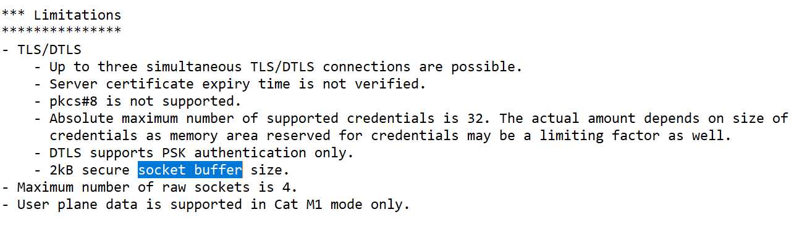

.. _limit_shadow_size:

Limiting the Shadow Document size
#################################

The nRF9160 DK has a size limit of 2303 bytes for receiving TLS packages.
See the following contents of the :file:`mfw_nrf9160_1.2.0_release_notes.txt` file in `nRF9160 modem firmware binaries (v1.2.0) <https://www.nordicsemi.com/-/media/Software-and-other-downloads/Dev-Kits/nRF9160-DK/nRF9160-modem-FW/mfwnrf9160120.zip>`_ for reference.

   nRF9160 Modem firmware 1.2.0 release notes content

*Bifravst* sets up an IoT rule, which only publishes the :code:`cfg` section of the `shadow document <../firmware/state.reported.aws.json>`_ to a separate topic :code:`$aws/things/<thing name>/shadow/get/accepted/desired/cfg` when devices receive their state after publishing an empty message to `\$aws/things/<thing name>/shadow/get <https://docs.aws.amazon.com/iot/latest/developerguide/device-shadow-mqtt.html#get-pub-sub-topic>`_.

The published object might be empty as shown below,if the device has no shadow or if the configuration is not set:

.. code-block:: json

    {}

Otherwise, the message will contain one top-level key :code:`cfg` and the desired device configuration as shown below:

.. literalinclude:: ./desired-cfg.json
  :language: JSON
