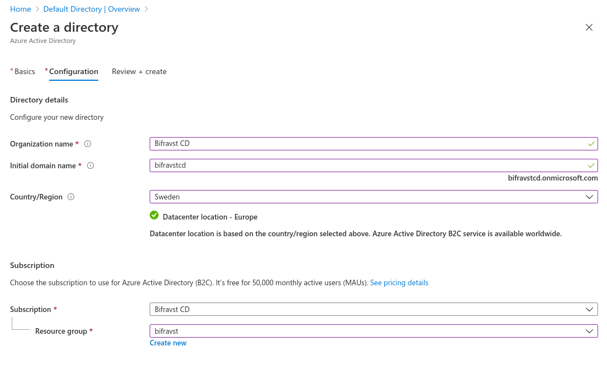
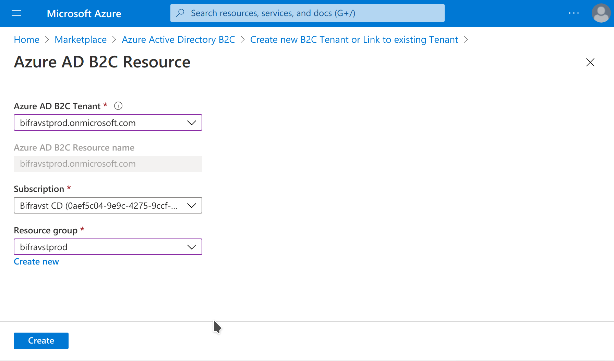
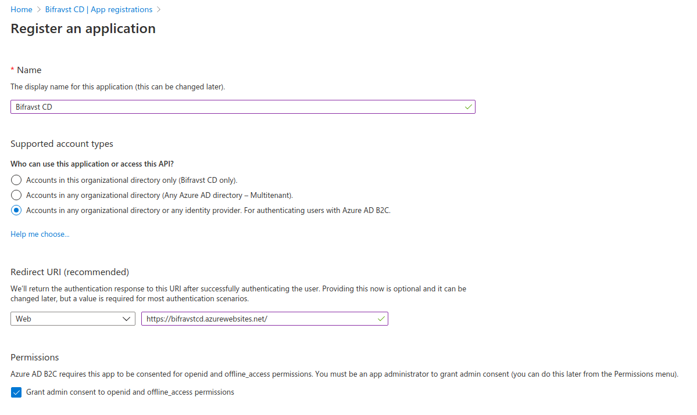
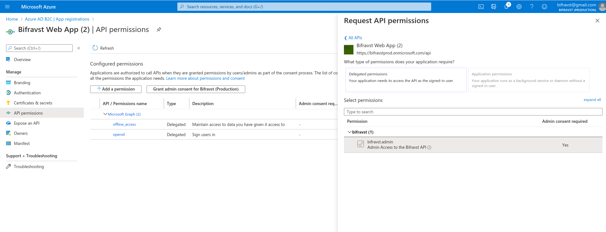
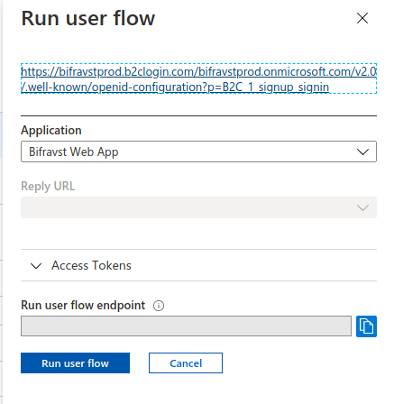

# Continuous Deployment

Continuous Deployment should be deployed with a dedicated subscription to have
clear control over permissions and costs.

## Create a subscription for Bifravst

1.  Go to the _Subscriptions_ blade and add a new subscription for Bifravst and
    name it _Bifravst CD_.
1.  After the subscription has been created navigate again to the
    _Subscriptions_ blade and copy the subscription id of the newly created
    subscription:

```
export SUBSCRIPTION_ID=<subscription id>
```

## Create an Azure Active Directory B2C

> _Note:_ This
> [can currently only be achieved through the CLI](https://github.com/bifravst/azure/issues/1).

4.  Go to the _Marketplace_ blade and search for _Azure Active Directory B2C_.
1.  Click the _Azure Active Directory B2C_ tile, and on then click the _Create_
    button.
1.  Select _Create a new Azure AD B2C Tenant._
1.  Use these settings:
    - Organization name: _Bifravst (Production)_
    - Initial domain name: `bifravstprod` (you need to pick something else that
      fits your project because this name is globally unique)
    - Country/Region: Sweden (or pick a location that is closer to you)
      
1.  Click _Next: Review + create_ to see the summary and then click _Create_ to
    create the new Active Directory B2C. It will take a while to be created.
1.  Copy the initial domain name:

```
export B2C_TENANT=bifravstprod
```

10. Switch to the newly created directory, by following the link in the success
    message.
1.  You need to link a Subscription to the B2C Directory, follow the link in the
    notification message to find the instructions.
    
1.  Select the subscription and create a new resource group for this assignment:
    
1.  Switch back to the B2C directory
1.  Create an App Registration:
    - Name: Bifravst Web App
    - Redirect URI (make sure to select SPA):
      `https://bifravstprodapp.z16.web.core.windows.net/` (instead of
      `bifravstprodapp` you need to pick something else that fits your project
      because this name is globally unique)
      
1.  In _Expose an API_ set the _Application ID URI_ to `api`
1.  Click _+ Add a scope_ and create a new scope:
    - Scope name: `bifravst.admin`
    - Admin consent display name: Admin Access to the Bifravst API
    - Admin consent description: Allows admin access to all resources exposed
      through the Bifravst API
1.  In _API permissions_ click _+ Add a permission_ and under _My APIs_ select
    the app registration
1.  Enable the `bifravst.admin` permission and click _Add permission_
1.  Click _Grant admin consent for &lt;your main directory&gt;_
    
1.  store the _application (client) id_ of the created Active Directory B2C App
    registration:

```
export APP_REG_CLIENT_ID=<application (client) id>
```

21. Enable the implicit grant flow for _Access tokens_ and _ID tokens_ and click
    _Save_:  
    
1. store the subdomain name used in the Redirect URI:

```
export APP_NAME=bifravstprodapp
```

23. Create the _Sign up and sign in_ user flow for local users, and name it
    `signup_signin`
    ([Reference](https://docs.microsoft.com/en-us/azure/active-directory-b2c/tutorial-create-user-flows)).
1. Select the created user flow and click _Run user flow_
1. Copy the Link in the pop-out:  
   

```
export B2C_ISSUER_URL=<User flow link>
```

26. Switch back to the main directory
1. Find the Bifravst Azure Function App
1. Select _Authentication / Authorization_
1. Select _Log in with Azure Active Directory_ for _Action to take when request
   is not authenticated_
1. Click _Azure Active Directory_ and configure the authentication using the
   _Advanced Management mode_:
   - Client ID: `$APP_REG_CLIENT_ID`
   - Issuer URL: `$B2C_ISSUER_URL`  
     

---

Now drop into a shell and login:

    az login

Enable required resources

    az provider register --subscription $SUBSCRIPTION_ID --namespace Microsoft.AzureActiveDirectory
    az provider register --subscription $SUBSCRIPTION_ID --namespace Microsoft.Storage
    az provider register --subscription $SUBSCRIPTION_ID --namespace Microsoft.Insights
    az provider register --subscription $SUBSCRIPTION_ID --namespace Microsoft.SignalRService
    az provider register --subscription $SUBSCRIPTION_ID --namespace Microsoft.DocumentDB
    az provider register --subscription $SUBSCRIPTION_ID --namespace Microsoft.Devices
    az provider register --subscription $SUBSCRIPTION_ID --namespace Microsoft.Web

Now create the CI credentials:

    az ad sp create-for-rbac --name GitHub --role Contributor --sdk-auth --scopes /subscriptions/${SUBSCRIPTION_ID} > ci-credentials.json

Create a resource group for Bifravst

    # Change to your liking
    export RESOURCE_GROUP_NAME=bifravstprod
    # Use "az account list-locations -o table" to list all locations
    export LOCATION=northeurope

    az group create --subscription $SUBSCRIPTION_ID --name $RESOURCE_GROUP_NAME --location $LOCATION

Fork the
[Bifravst Azure project](https://github.com/bifravst/azure/settings/secrets/new)
and add these secrets.

- `AZURE_CREDENTIALS`: store the contents of the JSON file created above
- `APP_REG_CLIENT_ID`: the _application (client) id_ of the created Active
  Directory B2C App registration
- `B2C_TENANT`: the _initial domain name_ of the created Active Directory B2C

Now trigger a deploy.
