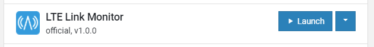

================================================================================
Flashing the certificate
================================================================================

Generating a certificate
================================================================================

Use the CLI to generate a certificate for your device. The firmware will
use the IMEI of the device as the MQTT client ID. You can read the IMEI
of your device using the AT command ``AT+CGSN``.

The output will look like this

.. code-block::

    352656100248049 OK

Use the IMEI when generating the certificate:

.. code-block:: bash

    node cli create-device-cert -d "<imei>"

Flashing using the CLI
================================================================================

.. note::

    This requires `Segger JLink <https://www.segger.com/downloads/jlink/>`_ to
    be installed and in your path.

Use the CLI to flash the device certificates. This will also download the latest
firmware from the `Firmware's GitHub releases page <https://github.com/bifravst/firmware/releases>`_
and flash it to the device.

.. code-block:: bash

    node cli flash "<imei>"

Flashing using nRF Connect for Desktop
================================================================================

You can use the ``certificates/device-<deviceId>.json`` file
with the *Certificate Manager* in the
`nRF Connect for Desktop <https://www.nordicsemi.com/Software-and-Tools/Development-Tools/nRF-Connect-for-desktop>`_
app *LTE Link Monitor* to flash certificate onto the device.

The *Certificate Manager* uses AT commands to write the certificate
information to the secure storage of the modem and you need to flash
your device with a firmware that has the AT command host enabled.

Flash the AT host using the *Programmer* app:

-   for the Thingy:91 use
    `thingy91_at_client_increased_buf.hex <https://github.com/bifravst/bifravst/releases/download/v4.2.1/thingy91_at_client_increased_buf.hex>`_
-   for the nRF9160 DK use
    `91dk_at_client_increased_buf.hex <https://github.com/bifravst/bifravst/releases/download/v5.9.2/91dk_at_client_increased_buf.hex>`_

.. figure:: ./images/programmer-desktop.png
   :alt: nRF Connect for Desktop Programmer

   nRF Connect for Desktop Programmer

Drag and Drop the HEX file (or select it via *Add HEX file*), click
*Erase & Write* and wait until the operation has finished.

.. figure:: ./images/programmer-modem-desktop.png
   :alt: nRF Connect for Desktop Programmer

   nRF Connect for Desktop Programmer

Afterwards, launch the *LTE Link Monitor* app.

   nRF Connect for Desktop LTE Link Monitor

Use the *Certificate Manager* with the JSON file to write the
certificate to the device.

.. figure:: ./images/certificate-manager-desktop.png
   :alt: nRF Connect for Desktop Certificate Manager

   nRF Connect for Desktop Certificate Manager

Drag and Drop or select the JSON file.

.. note::

    Change the security tag to ``42``. The modem can
    hold multiple credentials, and the default security tag
    ``16842753`` is reserved for
    `nRF Connect for Cloud <https://www.nordicsemi.com/Software-and-Tools/Development-Tools/nRF-Connect-for-Cloud>`_
    credentials.

.. warning::

    Make sure that the selected device is directly connected and
    not connected via the debugger!

Click *Update certificates* and wait until the operation finishes.
