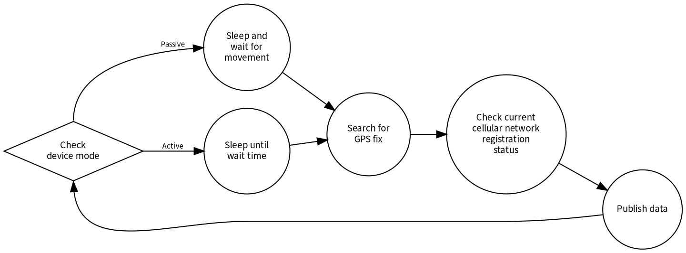

================================================================================
Functional Overview
================================================================================

The cat tracker device behaviour is dictated by a sequence of repeating
function calls called from the main module module after initialization.
This repeating sequence of functions are affected by dynamic device
configurations that is manipulated via the Cat Tracker Web Application.
In the firmware these configurations takes form of global variables
local to the main module which are checked by the respective functions
in the repeating sequence.

The device publishes data to a desired compatible cloud service
sequentially and upon movement depending on the current device mode. The
device mode can either be "active" or "passive". In "active" mode
the device publishes data sequentially every "active wait time"
interval and in "passive" mode the device publishes data every
"passive wait time" as long as there is movement detected by the
external accelerometer.

Repeating Sequence
================================================================================

    Repeating Sequence

1. Check device mode
--------------------------------------------------------------------------------

The application checks the current device mode. If it is in "active
mode" the device will immediately try to get a gps fix. If it is in
"passive" mode the main thread will go to sleep and not continue until
movement over a configurable threshold value is detected.

2. Search for GPS fix
--------------------------------------------------------------------------------

The device will try to obtain a GPS position fix within the GPS timeout
duration. If the fix is not obtained within the time limit the
publication message in the next cloud publication will not contain GPS
data. If a fix is obtained within the time limit the publication message
will contain GPS data. In addition, the time obtained from the GPS fix
is used to refresh the internal UTC date time timestamp variable used to
calculate timestamped attached to every publication message.

3. Check current cellular network registration status
--------------------------------------------------------------------------------

Check if the device is still registered to the cellular network. This
check manipulates an internal semaphore that will block cloud
publication if the device is not registered to a cellular network,
avoiding unnecessary call to functionality if the device is in fact not
connected. However, the modem can believe that it is registered to a
network when in fact it is not. This is due to the use of PSM intervals
which enables the connection intervals between the device and the
connected cellular tower to occur less frequent. This can dramatically
decrease the resolution of which the modem updates its cellular network
registration state. This is not a problem, the publication functionality
is non blocking and the application will not halt if it tries to publish
without a connection.

4. Publish data
--------------------------------------------------------------------------------

Publish data according to the schema below if device is still registered
to the cellular network.

5. Sleep
--------------------------------------------------------------------------------

The main thread sleeps in the duration of the current device mode wait
time.

+---------+----------+------------------------------------+
| Mode    | GPS fix? | Sensor/Modem data published        |
+=========+==========+====================================+
| Active  | Fix      | Battery, modem, GPS                |
+---------+----------+------------------------------------+
| Active  | No fix   | Battery, modem                     |
+---------+----------+------------------------------------+
| Passive | Fix      | Battery, modem, GPS, accelerometer |
+---------+----------+------------------------------------+
| Passive | No fix   | Battery, modem, accelerometer      |
+---------+----------+------------------------------------+

Cloud Communication
================================================================================

-   Upon a cloud connection the device will fetch its desired
    configuration from the cloud, apply the configuration and report the
    configuration back to the cloud.
-   Every publication to cloud the device will receive a message from
    the cloud if a setting has been changed in the web application. The
    device will then apply the updated configuration(s) and report its
    new configurations back to the cloud. Publication of
    sensor/modem/GPS data and updating device configurations happens in
    a determined order listed below.

Successful connection to cloud
--------------------------------------------------------------------------------

.. figure:: ./images/successful.svg
    :alt: Sequence: Successful connection to cloud

    Sequence: Successful connection to cloud

Data publication
--------------------------------------------------------------------------------

.. figure:: ./images/data-publication.svg
    :alt: Data publication

    Sequence: Data publication

Timestamping
================================================================================

All the data published to the cloud are timestamped in sample time UTC.
For more information about how timestamping is carried out in the cat tracker firmware see :ref:`Protocol <firmware-protocol-timestamping>` in the handbook.

Default configurations
================================================================================

If the device is unable to connect to the cloud after boot it will used
the following configurations:

+-----------------------------------------+-------------+
| Configuration                           | Default     |
+=========================================+=============+ 
| Active wait time                        | 60 sec      |
+-----------------------------------------+-------------+
| Movement resolution (passive wait time) | 60 sec      |
+-----------------------------------------+-------------+
| Movement timeout                        | 3600 sec    | 
+-----------------------------------------+-------------+
| Device mode                             | Active      |
+-----------------------------------------+-------------+
| GPS timeout                             | 60 sec      |
+-----------------------------------------+-------------+
| Accelerometer threshold                 | 100/10 m/s² |
+-----------------------------------------+-------------+
