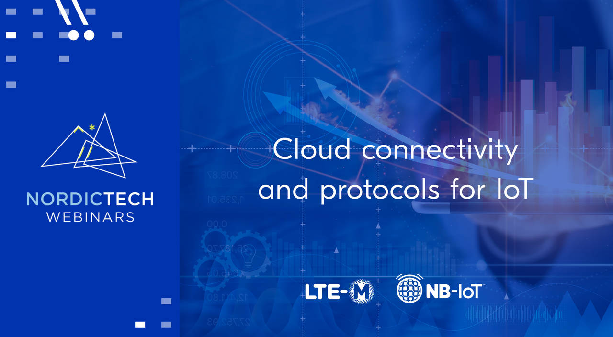

================================================================================
Cloud connectivity and protocols for the Internet of Things
================================================================================

This `Nordic Semiconductor Tech
Webinar <https://www.nordicsemi.com/Events/Webinars>`_ should be
interesting to everyone who wants to get an introduction to protocols to
consider when developing a cellular IoT product.

It provides an overview over the important factors that need to be
considered when it comes to picking the right solution for sending your
products' data to the cloud.

   Watch the recording on YouTube

The full recording including Q&A is available `here <https://webinars.nordicsemi.com/cloud-connectivity-and-protocols-5>`_.

Slides are available `interactive, browser-based <https://coderbyheart.github.io/nordicwebinar2020/index.html>`_ or as a
`PDF with all notes <https://devzone.nordicsemi.com/cfs-file/__key/support-attachments/beef5d1b77644c448dabff31668f3a47-cfd384f9b1874d3caf1df02c9677eca4/7065.Cloud-connectivity-and-protocols-for-the-Internet-of-Things-_2D00_-Notes.pdf>`_.

